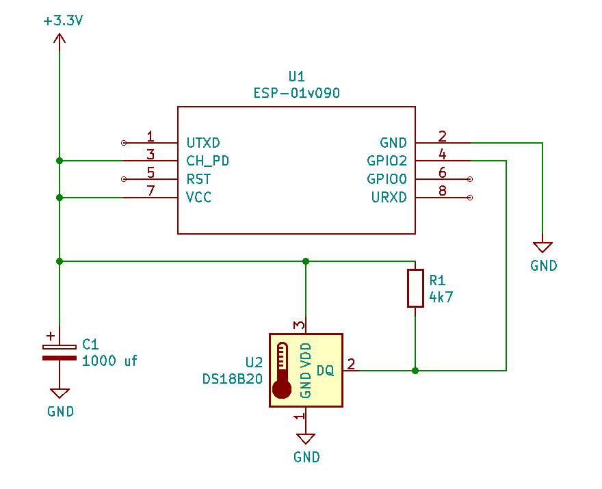

# env-bug

[enviroment bug] is a small device which will post through MQTT the room temperature.

## Hardware
- ESP-01 (esp8266) 
- DS18B20 temperature sensor

---
[This is a work in progress]

---

## Configuration

A Platform.io build > rename `config.example` into `config.h` at `./include` dir with your configurations and upload the code into your ESP

Schema:



# Hassio integration
Example for adding it as an [MQTT Sensor](https://www.home-assistant.io/integrations/sensor.mqtt/)

```yaml
sensor:
  - platform: mqtt
    name: "Temperature Room"
    state_topic: "room/temp"
    availability_topic: "room-env-bug/status"
    device_class: "temperature"
    unit_of_measurement: "°C"
    unique_id: "room-env-bug" 
```